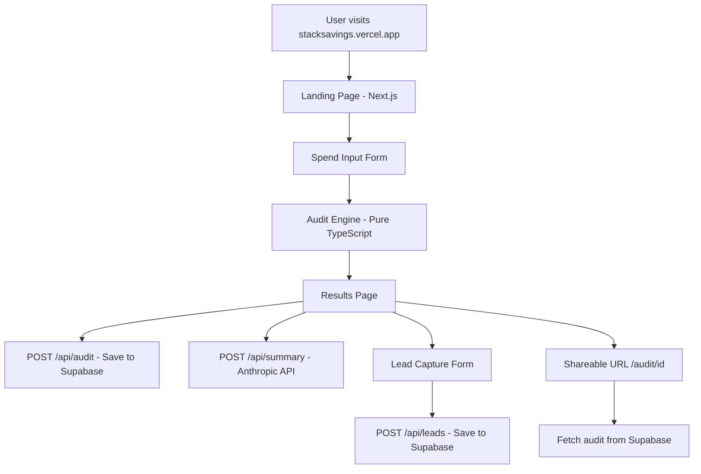

# Architecture — StackSavings

## System Diagram

## Data Flow

1. User fills the spend input form with their AI tools, plans, spend, and team size
2. On submit, the audit engine runs entirely client-side — pure TypeScript rules, no API call needed
3. Results display instantly on screen
4. In the background, the audit result is saved to Supabase via POST /api/audit
5. Simultaneously, POST /api/summary calls the Anthropic API to generate a personalized summary
6. If the user enters their email, POST /api/leads saves the lead to Supabase
7. The shareable URL (/audit/[id]) fetches the audit from Supabase and renders a public page

## Why This Stack

**Next.js 14 (App Router)** — Handles frontend and backend in one repo. API routes live alongside pages. Deploys to Vercel in one click. TypeScript-first.

**Supabase** — Free tier Postgres with a clean dashboard. Row-level security for data protection. Real-time capable if we need it later. No vendor lock-in — it's just Postgres.

**Anthropic API (claude-haiku)** — Fastest and cheapest Claude model. Perfect for generating a ~100 word summary. Haiku completes in under 2 seconds. Graceful fallback if API is unavailable.

**Tailwind CSS + shadcn/ui** — Utility-first styling with pre-built accessible components. No time wasted on CSS from scratch. Consistent design tokens.

**Vercel** — Zero-config deployment for Next.js. Auto-deploys on every push to main. Edge network for fast global load times.

## What I'd Change for 10k Audits/Day

1. **Rate limiting** — Add Upstash Redis-based rate limiting on the API routes to prevent abuse
2. **Queue the AI summary** — Move Anthropic API calls to a background job queue (e.g. Inngest) so the results page loads instantly and the summary appears when ready
3. **Database indexing** — Add indexes on `audits.created_at` and `leads.email` for faster queries
4. **CDN caching** — Cache shareable audit pages at the edge since they're read-only after creation
5. **Analytics** — Add PostHog for funnel tracking: form start → audit complete → email captured → link shared