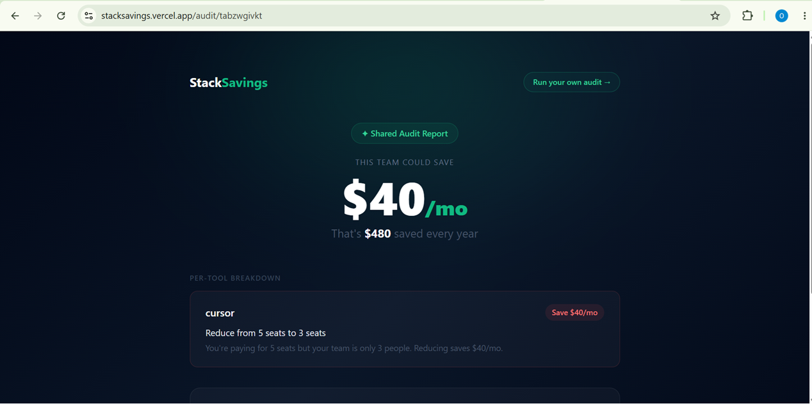

# StackSavings — Free AI Spend Audit for Startups

StackSavings is a free web app that audits your team's AI tool spending and shows exactly where you're overspending — with specific recommendations and total potential savings. Built as a lead-generation tool for [Credex](https://credex.rocks).

**Live URL:** https://stacksavings.vercel.app

---

## Screenshots

### Landing Page


### Results Page


### Shareable Audit URL


---

## Quick Start

```bash
git clone https://github.com/elegbedeoladapo-hash/stacksavings.git
cd stacksavings
npm install
cp .env.local.example .env.local  # add your keys
npm run dev
```

Open http://localhost:3000

## Environment Variables